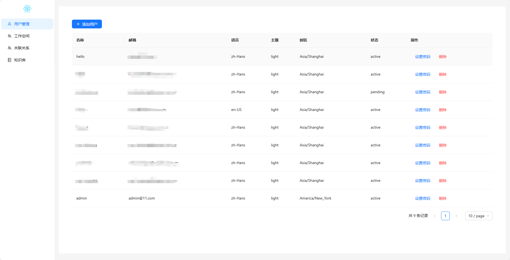
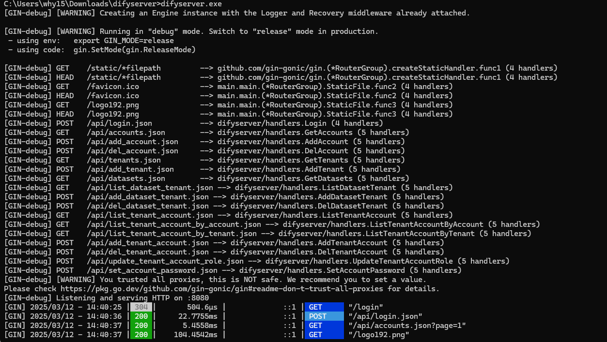

# DifyServer

DifyServer 是一个用于管理 Dify 多租户和用户权限的管理系统。它提供了用户管理、工作空间管理、权限控制等功能。

## 功能特点

- 用户管理：创建、删除用户，修改密码
- 工作空间管理：创建和管理多个工作空间
- 权限控制：管理用户与工作空间的关联关系
- 知识库展示：查看各工作空间的知识库

## 技术栈

- 后端：Go + Gin + GORM
- 前端：React + TypeScript + Ant Design
- 数据库：PostgreSQL

## 快速开始

### 配置

创建 `config.yaml` 文件：

```yaml
database:
  host: "localhost"
  port: 5432
  user: "postgres"
  password: "your_password"
  dbname: "dify"

admins:
  - "admin@example.com"
  - "another_admin@example.com"
```

### 运行
1. 从 Releases 下载最新版本
2. 解压下载的文件
3. 修改 config.yaml 配置文件
4. 运行可执行文件：
   - Windows: difyserver.exe
   - Linux: ./difyserver
### 开发环境搭建

1. 克隆仓库：
```bash
git clone https://github.com/weiwhy/DifyServer.git
 ```

2. 安装前端依赖：

```bash
cd frontend
npm install
 ```

3. 构建前端：
4. 
```bash
npm run build
 ```

4. 编译后端：
```bash
go build
 ```

## 截图





## 许可证
MIT License

## 贡献
欢迎提交 Issue 和 Pull Request！